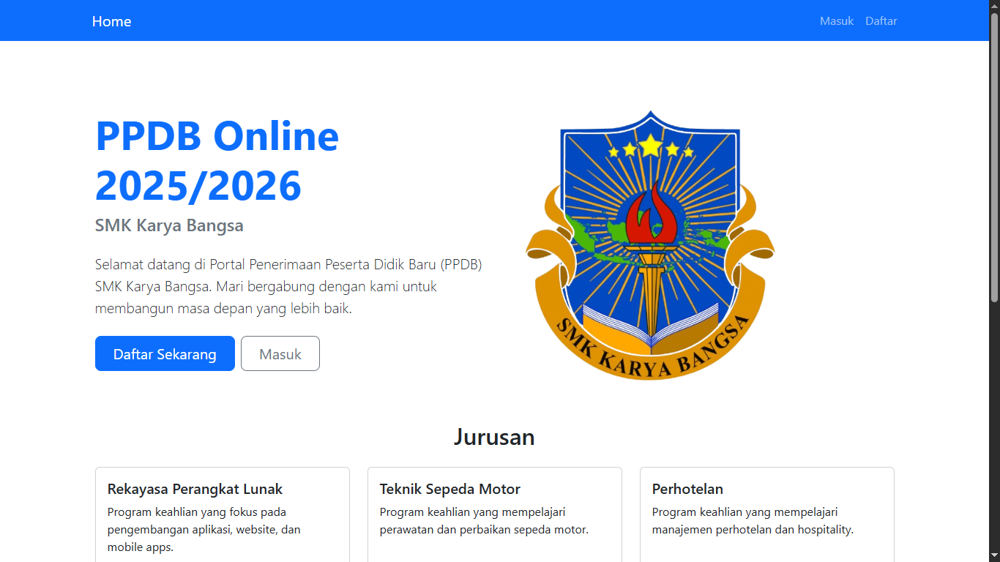

# PPDB Online SMK Karya Bangsa 2025/2026



## Overview
Sistem Penerimaan Peserta Didik Baru (PPDB) Online untuk SMK Karya Bangsa. Aplikasi berbasis web ini memungkinkan calon siswa untuk mendaftar secara online dan memudahkan admin dalam mengelola proses pendaftaran.

## Features

### User Features
- Registrasi dan login akun
- Form pendaftaran online dengan data:
  - Data pribadi (nama, tempat/tanggal lahir, alamat, dll)
  - Data akademik (nilai rata-rata, pilihan jurusan)
  - Upload dokumen ijazah
- Status tracking pendaftaran realtime
- Progress bar status pendaftaran
- Preview dan unduh formulir

### Admin Features
- Dashboard admin dengan statistik:
  - Total pendaftar
  - Pendaftar menunggu
  - Pendaftar diterima
  - Pendaftar ditolak
- Manajemen pendaftaran:
  - Review formulir pendaftaran
  - Terima/tolak pendaftaran
  - Lihat detail pendaftar
- Export data pendaftar

## Tech Stack
- **Backend**: Python Flask
- **Database**: SQLite + SQLAlchemy
- **Frontend**: 
  - Bootstrap 5
  - HTML/CSS/JavaScript 
  - Jinja2 Templates
- **Authentication**: Flask-Login
- **File Upload**: Werkzeug

## Prerequisites
- Python 3.8+
- pip (Python package manager)
- Virtual environment

## Installation & Setup

1. Clone repository
```bash
git clone https://github.com/yourusername/ppdb-smk-karya-bangsa.git
cd ppdb-smk-karya-bangsa
```

2. Buat virtual environment
```bash
python -m venv venv
```

3. Aktifkan virtual environment
```bash
# Windows
venv\Scripts\activate

# Linux/Mac
source venv/bin/activate
```

4. Install dependencies
```bash
pip install -r requirements.txt
```

5. Setup database
```bash
flask db init
flask db migrate
flask db upgrade
```

6. Jalankan aplikasi
```bash
python run.py
```

## Project Structure
```
ppdb-smk-karya-bangsa/
├── app/
│   ├── static/
│   │   ├── images/
│   │   └── uploads/
│   ├── templates/
│   │   ├── admin/
│   │   ├── auth/
│   │   └── user/
│   ├── routes/
│   │   ├── admin.py
│   │   ├── auth.py
│   │   └── user.py
│   ├── models.py
│   └── __init__.py
├── migrations/
├── venv/
├── config.py
├── requirements.txt
└── run.py
```

## Database Models

### User
- id (Primary Key)
- username
- password (hashed)
- role (admin/user)
- is_accepted
- formulir (relationship)

### Formulir
- id (Primary Key)
- user_id (Foreign Key)
- nama
- tempat_lahir
- tanggal_lahir
- alamat
- asal_sekolah
- kelamin
- agama
- jurusan
- nilai_rata
- status
- ijazah_filename
- created_at
- updated_at

## Screenshots
- [Landing Page](app/static/images/dokumentasi/landing.png)
- [Login Page](app/static/images/dokumentasi/login.png)
- [Admin Dashboard](app/static/images/dokumentasi/admin.png)
- [Form Pendaftaran](app/static/images/dokumentasi/formulir.png)
- [Detail Pendaftaran](app/static/images/dokumentasi/detail.png)

## Contributing
1. Fork repository
2. Buat branch fitur baru (`git checkout -b feature/AmazingFeature`)
3. Commit perubahan (`git commit -m 'Add some AmazingFeature'`)
4. Push ke branch (`git push origin feature/AmazingFeature`)
5. Buka Pull Request

## License
Distributed under the MIT License. See `LICENSE` for more information.

## Contact
Project Link: [# PPDB Online SMK Karya Bangsa 2025/2026


## Overview
Sistem Penerimaan Peserta Didik Baru (PPDB) Online untuk SMK Karya Bangsa. Aplikasi berbasis web ini memungkinkan calon siswa untuk mendaftar secara online dan memudahkan admin dalam mengelola proses pendaftaran.

## Features

### User Features
- Registrasi dan login akun
- Form pendaftaran online dengan data:
  - Data pribadi (nama, tempat/tanggal lahir, alamat, dll)
  - Data akademik (nilai rata-rata, pilihan jurusan)
  - Upload dokumen ijazah
- Status tracking pendaftaran realtime
- Progress bar status pendaftaran
- Preview dan unduh formulir

### Admin Features
- Dashboard admin dengan statistik:
  - Total pendaftar
  - Pendaftar menunggu
  - Pendaftar diterima
  - Pendaftar ditolak
- Manajemen pendaftaran:
  - Review formulir pendaftaran
  - Terima/tolak pendaftaran
  - Lihat detail pendaftar
- Export data pendaftar

## Tech Stack
- **Backend**: Python Flask
- **Database**: SQLite + SQLAlchemy
- **Frontend**: 
  - Bootstrap 5
  - HTML/CSS/JavaScript 
  - Jinja2 Templates
- **Authentication**: Flask-Login
- **File Upload**: Werkzeug

## Prerequisites
- Python 3.8+
- pip (Python package manager)
- Virtual environment

## Installation & Setup

1. Clone repository
```bash
git clone https://github.com/yourusername/ppdb-smk-karya-bangsa.git
cd ppdb-smk-karya-bangsa
```

2. Buat virtual environment
```bash
python -m venv venv
```

3. Aktifkan virtual environment
```bash
# Windows
venv\Scripts\activate

# Linux/Mac
source venv/bin/activate
```

4. Install dependencies
```bash
pip install -r requirements.txt
```

5. Setup database
```bash
flask db init
flask db migrate
flask db upgrade
```

6. Jalankan aplikasi
```bash
python run.py
```

## Project Structure
```
ppdb-smk-karya-bangsa/
├── app/
│   ├── static/
│   │   ├── images/
│   │   └── uploads/
│   ├── templates/
│   │   ├── admin/
│   │   ├── auth/
│   │   └── user/
│   ├── routes/
│   │   ├── admin.py
│   │   ├── auth.py
│   │   └── user.py
│   ├── models.py
│   └── __init__.py
├── migrations/
├── venv/
├── config.py
├── requirements.txt
└── run.py
```

## Database Models

### User
- id (Primary Key)
- username
- password (hashed)
- role (admin/user)
- is_accepted
- formulir (relationship)

### Formulir
- id (Primary Key)
- user_id (Foreign Key)
- nama
- tempat_lahir
- tanggal_lahir
- alamat
- asal_sekolah
- kelamin
- agama
- jurusan
- nilai_rata
- status
- ijazah_filename
- created_at
- updated_at

## Screenshots
- [Landing Page](app/static/images/dokumentasi/landing.png)
- [Login Page](app/static/images/dokumentasi/login.png)
- [Admin Dashboard](app/static/images/dokumentasi/admin.png)
- [Form Pendaftaran](app/static/images/dokumentasi/formulir.png)
- [Detail Pendaftaran](app/static/images/dokumentasi/detail.png)

## Contributing
1. Fork repository
2. Buat branch fitur baru (`git checkout -b feature/AmazingFeature`)
3. Commit perubahan (`git commit -m 'Add some AmazingFeature'`)
4. Push ke branch (`git push origin feature/AmazingFeature`)
5. Buka Pull Request

## License
Distributed under the MIT License. See `LICENSE` for more information.

## Contact
Project Link: (https://github.com/Ilham-1945/Project-Ilham-XI-RPL)

## Acknowledgments
- [Flask](https://flask.palletsprojects.com/)
- [Bootstrap](https://getbootstrap.com/)
- [SQLAlchemy](https://www.sqlalchemy.org/)
- [Font Awesome](https://fontawesome.com/))

## Acknowledgments
- [Flask](https://flask.palletsprojects.com/)
- [Bootstrap](https://getbootstrap.com/)
- [SQLAlchemy](https://www.sqlalchemy.org/)
- [Font Awesome](https://fontawesome.com/)